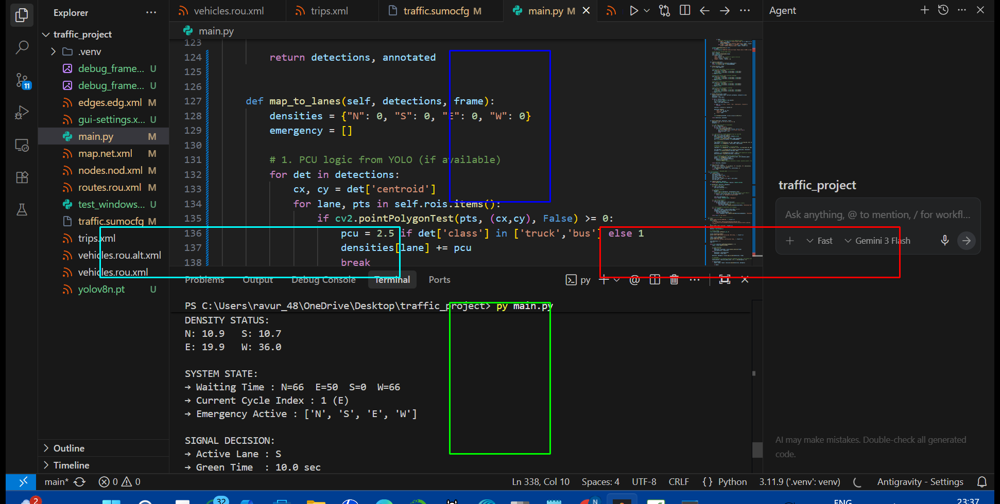

# Intelligent Digital Twin: AI-Vision Traffic Control System

A high-performance, **Digital Twin** traffic management system that bridges the gap between simulated urban environments and physical hardware. This project uses **YOLOv8** to monitor **SUMO (Simulation of Urban MObility)** environments and intelligently controls traffic signals using real-time Computer Vision and Signal Preemption logic.



## 🌟 Key Innovations

### 1. Hybrid Perception (Vision + Simulation)
Unlike standard traffic simulations that rely on internal data, this system uses a **Vision Agent** to "see" the traffic just like a real-world CCTV camera.
- **YOLOv8 Detection**: Real-time identification of cars, trucks, and buses.
- **Weighted Density**: Larger vehicles (trucks/buses) are weighted 2.5x more than cars to better represent road pressure.
- **Hybrid Max-Pooling**: The system compares Vision data against raw SUMO data and selects the highest value, ensuring zero failure even if the camera view is partially obstructed.

### 2. Emergency Vehicle (EV) Preemption
A professional-grade emergency priority system:
- **Instant Interrupt**: When an ambulance is detected (via blue-color signature), the system **immediately preempts** the current green light, instantly cutting its timer to zero.
- **Safety Transitions**: Triggers a forced Yellow (3s) and All-Red (2s) phase to clear the intersection before the ambulance proceeds.
- **Blind-Spot Prevention**: Regions of Interest (ROI) are extended to the center of the intersection to maintain continuous tracking of the EV until it has fully cleared the junction.

### 3. Hardware-in-the-Loop (Digital Twin)
The simulation is locked to a physical **Arduino/ESP32** traffic controller.
- **Serial Communication**: Every signal change (Green/Yellow/Red) in the digital world is instantly transmitted over USB Serial to physical LEDs.
- **Real-Time Sync**: 1 simulation second = 1 real second, creating a perfect mirror between global simulation and physical hardware.

## 🛠️ Tech Stack

- **Core Logic**: Python 3.10+
- **Traffic Engine**: Eclipse SUMO
- **AI/CV**: Ultralytics YOLOv8
- **Hardware**: Arduino / ESP32 (C++ / `.ino`)
- **Libraries**: TraCI, MSS (Screen Capture), NumPy, OpenCV, PySerial

## 📋 Setup & Installation

1.  **SUMO**: [Install Eclipse SUMO](https://www.eclipse.org/sumo/) and set the `SUMO_HOME` environment variable.
2.  **Dependencies**:
    ```bash
    pip install opencv-python numpy mss pywin32 ultralytics pyserial
    ```
3.  **Hardware**: Upload `arduino_traffic_control.ino` to your Arduino/ESP32 and update the `ARDUINO_PORT` in `main.py` (default is `COM7`).

## 🏃 Running the Project

1.  Launch the controller:
    ```bash
    python main.py
    ```
2.  The script will:
    - Open the SUMO-GUI automatically.
    - Connect to the Arduino on the specified COM port.
    - Start the live Vision Analysis window.

## 📂 Project Structure

- `main.py`: The main controller (Vision Agent, Decision Logic, Hardware Interface).
- `arduino_traffic_control.ino`: Firmware for the physical LED traffic lights.
- `traffic.sumocfg`: Network and route configuration for SUMO.
- `map.net.xml`: The 4-way junction design.
- `routes.rou.xml`: Traffic demand definitions.

---
*Developed by Muniswar Talasila for advanced urban mobility and AI-driven automation experiments.*
